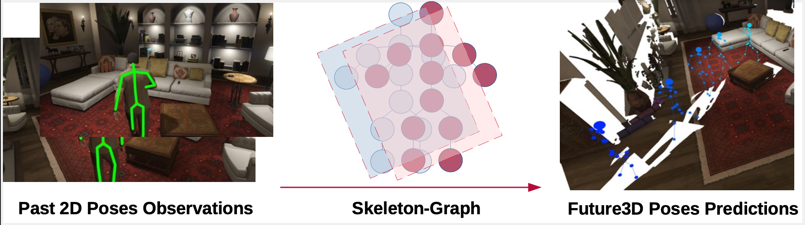

# Skeleton-Graph: Long-Term 3D Motion Prediction From 2D Observations Using Deep Spatio-Temporal Graph CNNs Code instructions
### Abduallah Mohamed, Huancheng Chen, Zhangyang Wang, Christian Claudel
#### The University of Texas at Austin
#### *To appear in the The ROAD Challenge: Event Detection for Situation Awareness in Autonomous Driving ICCV 2021 Workshop

## Code for: "Skeleton-Graph: Long-Term 3D Motion Prediction From 2D Observations Using Deep Spatio-Temporal Graph CNNs", ICCV 2021 ROAD
Read the full paper [here](https://arxiv.org/pdf/2109.10257.pdf)

<div align='center'>
</img>
</div>
<br />

#### Code Instructions: 
#### Environment 
Python3

We used pipreqs to generate the requirements.txt, thus we have the minimal packages needed.

#### Code structure 
* train.py //For training and evaluating the model 

* utils.py //For evaluation metrics

* model.py //Our Skeleton-Graph model with all configurations

* gtaimdset.py //GTA-IM dataset, with auto save for faster loading

* proxdset.py //PROX dataset, with auto save for faster loading (might occupy a huge memeory)

* The dataset folders GTAIMFPS5, PROX are included

* To obtain the GTAIM dataset please check: https://github.com/ZheC/GTA-IM-Dataset#requesting-dataset 

* To obtain the PROX dataset please check: https://prox.is.tue.mpg.de/

#### Running the code for training and evaluation

We mainly use a .sh files to execute multiple expriements in parallel. 

The exprimenets are saved in checkpoint with unique id. Also, when the dataset is computed for the first time
it takes a while. The data loader in the case of GTA-IM saves a copy for faster future loading, yet depednding on you PC mem you might want to disable this option by setting 'save=false' in the data loaders. 

For example to train on GTA-IM dataset with 1 second input(5 frames), 2 seconds output (5 frames) with 5/11 (5 sgcnn, 11 txcnn) layers execute this command. 
```bash
CUDA_VISIBLE_DEVICES=1 python3 train.py --lr 0.01 --n_stgcnn 5 --n_txpcnn 11  --dataset GTA_IM --use_lrschd --num_epochs 450  --tag 1 
```

To evaluate simple add to the same settings --torso_joint 13 --eval_only , hinting to code to evaluate and select the torso joint for path evaluation. The command will be: 
```bash
CUDA_VISIBLE_DEVICES=1 python3 train.py --lr 0.01 --n_stgcnn 5 --n_txpcnn 11  --dataset GTA_IM --use_lrschd --num_epochs 450  --tag 1 --torso_joint 13 --eval_only
```
You can explore the different .sh files in the sh folder for more examples. 

####  Visualization
We use [Open3d](http://www.open3d.org/docs/release/) to visualize the prediction and target skeleton points.
For running visualization.py, we need the same configuration to validation, just for generating the hash checkpoints filename. We load the trained model and get prediction and target, save them in lists.

For example:
```bash
CUDA_VISIBLE_DEVICES=1 python3 visualization.py --lr 0.01 --n_stgcnn 5 --n_txpcnn 11  --dataset GTA_IM --use_lrschd --num_epochs 450  --tag 1   --torso_joint 13 --eval_only 
```

in the code, we just load one of the batches, you can modify the 'batch_id' to get the batch you want. 
With the data of prediction and target, we can draw lines and points with Open3d and store them as npy and ply files.
Match the frame you want to visualize, and load the corresponding line-set and point-set. For example: 'lineset_63.ply', 'lineset_target_63.ply', 'joints_63.npy', 'joints_target_63.npy'.

Notice: The drawing window is disabled in jupyter notebook.


